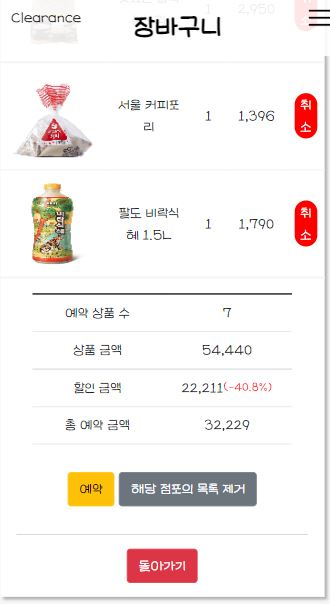
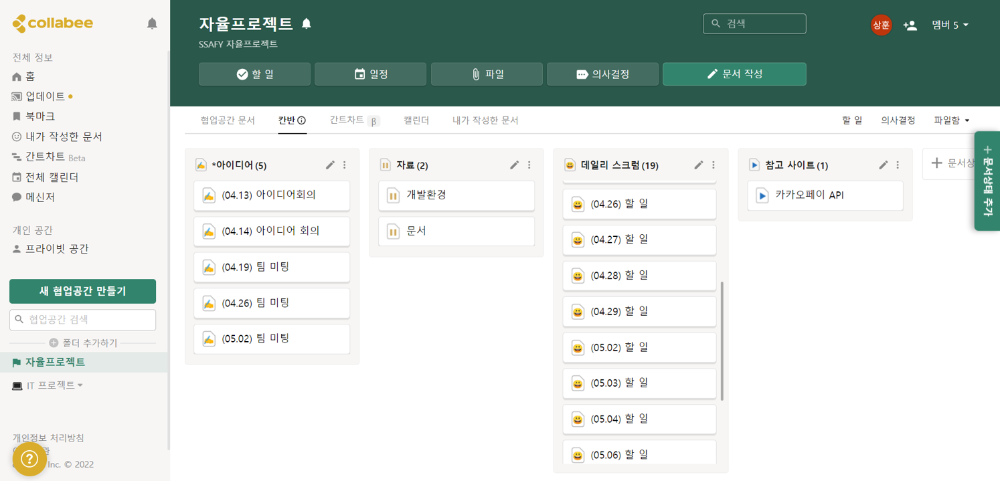

   
  
   
  <h1>클리어런스</h1>
   

## 목차

1. **서비스 소개**
2. **기술 스택**
3. **Backend**
4. **Frontend**
5. **협업 관리**
6. **산출물**
7. **개발 멤버 소개**

 

## 💡 1. 서비스 소개

### 일상 속 탄소 배출량 감소를 위한 서비스 "Clearance"

> 전국에 있는 재활용 처리 시설 370곳에서 사료나 퇴비, 바이오가스로 전환하여도 매번 약 20% 이상의 음식물이 남아  
> 남은 것들을 소각하거나 매립장으로 보낼때마다 그만큼의 환경 문제가 발생되고 있었습니다.  Clearance는 매년 계속해서 증가하는 식품 폐기물을 감소시키기 위한 방안에 대해서 고려하였습니다.

#### 마트는 폐기 예정인 물품을 등록하여서 수익을 창출, 소비자는 값싼 가격에 구입할 수 있도록 서비스를 구현하는 것이 서비스의 주요 목표!

 

## 🛠️ 2. 기술 스택

      
     
   
   

 <b> 상세 기술스택 및 버전</b> 

| 구분     | 기술스택        | 상세내용             | 버전                                        |
| -------- | --------------- | -------------------- | ------------------------------------------- |
| 공통     | 형상관리        | Gitlab               | \-                                          |
|          | 이슈관리        | Jira                 | \-                                          |
|          | 커뮤니케이션    | Mattermost, Collabee | \-                                          |
| BackEnd  | DB              | MySQL                | 8.0.28-0ubuntu0.20.04.3 for Linux on x86_64 |
|          |                 | JPA                  | \-                                          |
|          |                 | QueryDSL             | \-                                          |
|          | Java            | Zulu                 | 8.33.0.1                                    |
|          | Spring          | Spring               | 5.3.19                                      |
|          |                 | Spring Boot          | 2.6.7                                       |
|          | Python          |                      | 3.8.5                                       |
|          | Flask           |                      | 2.1.1                                       |
|          | IDE             | IntelliJ             | 7.4.1                                       |
|          | Build           | Gradle               | 7.3.2                                       |
|          | API Docs        | Swagger2             | 3.0.0                                       |
| FrontEnd | HTML5           |                      | \-                                          |
|          | CSS3            |                      | \-                                          |
|          | JavaScript(ES6) |                      | \-                                          |
|          | React           | React                | 18.0.0                                      |
|          |                 | react-bootstrap      | 2.3.0                                       |
|          |                 | react-datepicker     | 4.7.0                                       |
|          |                 | react-dom            | 18.0.0                                      |
|          |                 | react-kakao-maps-sdk | 1.0.7                                       |
|          |                 | react-qr-reader      | 3.0.0                                       |
|          |                 | react-reveal         | 1.2.2                                       |
|          |                 | react-router-dom     | 6.3.0                                       |
|          |                 | react-scripts        | 5.0.1                                       |
|          |                 | web-vitals           | 2.1.4                                       |
|          |                 | zustand              | 2.1.4                                       |
|          | IDE             | Visual Studio Code   | 4.0.0                                       |
| Server   | 서버            | AWS EC2              | \-                                          |
|          |                 | Nginx                | 1.20.2                                      |
|          | 플랫폼          | Ubuntu               | 20.04.3 LTS                                 |
|          | 배포            | Docker               | 20.10.13                                    |
|          |                 | Docker-composer      | 1.25.0                                      |
|          |                 | Jenkins              | 2.339                                       |

 

## 🗂️ 3. Backend

|          시스템 구성          |
| :---------------------------: |
|  |

|        디렉토리 구조         |
| :--------------------------: |
|  |

 

## 🖥️ 4. Frontend

### 메인페이지

- 접속 시 사용자의 위치 정보를 받아와 데이터베이스 내에 등록된 인근 매장의 지도 마커 표시
- 인근 매장에 등록된 상품들을 카테고리 별로 분류하여 사용자에게 제공
- 사용자는 매장별 등록된 상품에 대해 조회가 가능하며 필요한 수량만큼 장바구니에 추가 가능

|                                                               메인                                                               |
| :------------------------------------------------------------------------------------------------------------------------------: |
|   |

### 예약

- 장바구니에 담은 후 계속해서 쇼핑 or 장바구니로 이동이 가능
- 장바구니 내부에서는 각 매장별 장바구니에 추가한 상품 목록들에 대해 조회 가능
- 장바구니의 상품들을 예약완료 하였을 경우 해당 매장에 대한 정보와 상품 리스트, 결제예정 금액에 대한 정보 제공

|                                                                                              예약                                                                                              |
| :--------------------------------------------------------------------------------------------------------------------------------------------------------------------------------------------: |
|    |

### 마이페이지

- (매장) 매장별 등록된 상품의 유효기간을 한눈에 볼 수 있도록 캘린더 기능 제공
- (매장) 매장별 등록된 상품의 리스트를 제공하여 효율적인 상품 관리 가능
- (사용자) 사용자별 예약 현황에 대한 파악이 가능하도록 캘린더 기능 제공
- (사용자) 전체, 예약, 거래완료 별로 분류하여 파악 가능

| 마이페이지 |                                                                                                                                                                                                             |
| :--------: | ----------------------------------------------------------------------------------------------------------------------------------------------------------------------------------------------------------- |
|    매장    |    |
|   구매자   |       |

### QR코드

- (사용자) 예약현황을 파악하기 위한 QR 코드 기능
- (매장) 사용자의 QR 코드를 스캔하여 사용자가 예약한 상품 리스트 조회 후 서비스 제공
- (매장) 거래완료 후 버튼 클릭을 통해 예약 -> 거래 완료 상태 변환이 가능하도록 기능 구현

|                                                                     QR코드                                                                     |
| :--------------------------------------------------------------------------------------------------------------------------------------------: |
|    |

### 탄소 발자국

- (매장) 현재 시점까지 매장에서 판매한 상품들에 대해 누적된 탄소 저감량을 그래프를 통해 표시
- (사용자) 현재 시점까지 구매자가 구입한 상품들에 대해 누적된 탄소 저감량을 그래프를 통해 표시

|                탄소 발자국                 |
| :----------------------------------------: |
|  |

## 👥 5. 협업 관리

|                    Jira BurnDown Chart                    |
| :-------------------------------------------------------: |
|  |

|                  Collabee                   |
| :-----------------------------------------: |
|  |

 

## 📋 6. 산출물

| 구분                |                                                               링크                                                               |
| :------------------ | :------------------------------------------------------------------------------------------------------------------------------: |
| 기획서              |                                     [기획서 바로가기](/exec/프로젝트_계획서_부울경_E203.pdf)                                     |
| 요구사항/API 정의서 | [요구사항 정의서 바로가기](https://docs.google.com/spreadsheets/d/11YK9m3-BMdoCCrjv6fx36IJgI-pvypHpYIhc1MlR5Oc/edit#gid=9810042) |
| 플로우차트          |                                [플로우차트 바로가기](https://www.mindmeister.com/map/2253219011)                                 |
| 스토리보드          |                          [스토리보드 바로가기](https://www.figma.com/file/MPWOWxpHMV9bMNM4btjs3r/E203)                           |
| ERD                 |                                 [ERD 바로가기](https://www.erdcloud.com/team/jCG5JFqNeZTLtQGWN)                                  |
| 발표자료            |                                             [발표자료 바로가기](/exec/발표자료.pdf)                                              |

 

## 👪 7. 개발 멤버 소개

<table>
    <tr>
        <td height="140px" align="center">
                
            👑 강광은  (Front-End)  
        </td>
        <td height="140px" align="center">
                
            🙂 김범주  (Front-End)  
        </td>
        <td height="140px" align="center">
                
            😁 차상훈  (Back-End)  
        </td>
        <td height="140px" align="center">
                
            🙄 김윤지   (Back-End)  
        </td>
        <td height="140px" align="center">
                
            😶 박진성  (Back-End)  
        </td>
    </tr>
    <tr>
        <td align="center">UI/UX React</td>
        <td align="center">UI/UX React</td>
        <td align="center">REST API Database CI/CD</td>
        <td align="center">REST API Database Infra </td>
        <td align="center">REST API React</td>
    </tr>
</table>

 
